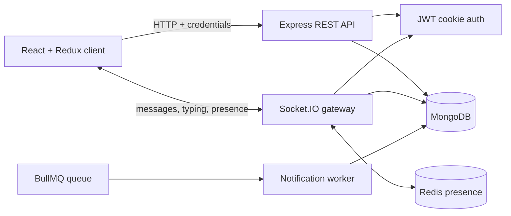

# DevTinder Backend

The API and real-time communication service behind **DevTinder**—a developer networking platform where people discover profiles, express interest, form connections, and chat after a request is accepted.

[Frontend repository](https://github.com/alwayssaheb/DevTinder-Frontend) · [Live application](https://dev-tinder-frontend-rust.vercel.app) · [Portfolio case study](https://you-three-snowy.vercel.app/projects/devtinder)

[](https://you-three-snowy.vercel.app/devtinder-demo.mp4)

**[Watch the product walkthrough →](https://you-three-snowy.vercel.app/devtinder-demo.mp4)**

## What the project does

DevTinder turns developer discovery into a permission-aware social workflow:

1. A user creates a validated profile and signs in.
2. The discovery feed excludes the current user and anyone with an existing request relationship.
3. A user can express interest in or ignore another profile.
4. The recipient accepts or rejects an incoming request.
5. Only accepted connections can load chat history, send messages, or emit typing events.
6. Messages are persisted, delivered live when the recipient is online, and surfaced as unread notifications.

The backend owns these rules so they remain consistent across both HTTP endpoints and Socket.IO events.

## Engineering highlights

- **Cookie-based authentication** — passwords are hashed with bcrypt and JWTs are stored in HTTP-only cookies with production-aware security attributes.
- **Connection-level authorization** — chat history and real-time events both verify that the two users have an accepted connection.
- **Real-time messaging** — Socket.IO handles message delivery, sender acknowledgements, typing indicators, and online/offline events.
- **Redis presence** — online users are mapped to socket IDs for direct delivery and cleaned up safely on disconnect.
- **Persistent conversations** — MongoDB stores users, connection requests, messages, and notifications as separate domain models.
- **Background-processing path** — a BullMQ worker is implemented for asynchronous notification creation, with completion and failure hooks.
- **Safe discovery queries** — feed pagination is capped and only public profile fields are returned.

> **Deployment note:** The hosted demo currently creates notifications inline because its web deployment does not run the separate long-lived BullMQ worker. The worker and queue configuration remain available for deployments that support a dedicated worker process.

## Architecture



## Technology

| Area | Technology |
| --- | --- |
| Runtime and API | Node.js, Express.js |
| Database | MongoDB, Mongoose |
| Authentication | JSON Web Tokens, HTTP-only cookies, bcryptjs |
| Real-time transport | Socket.IO |
| Presence and queue infrastructure | Redis, BullMQ |
| Validation | validator, Mongoose schema validation |

## Domain models

| Model | Responsibility |
| --- | --- |
| `User` | Identity, credentials, profile details, photo, and skills |
| `ConnectionRequest` | Directional request relationship and its current status |
| `Chat` | Persisted sender-to-receiver message with timestamps |
| `Notification` | Unread message notification linked to its chat message |

## REST API

All protected routes require the `token` cookie created during signup or login.

### Authentication and profile

| Method | Route | Purpose | Auth |
| --- | --- | --- | --- |
| `POST` | `/signup` | Validate input, hash the password, create a user, and start a session | No |
| `POST` | `/login` | Validate credentials and start a session | No |
| `POST` | `/logout` | Clear the session cookie | No |
| `GET` | `/profile/view` | Return the authenticated user's profile | Yes |
| `POST` | `/profile/edit` | Update allowed profile fields | Yes |

### Discovery and connections

| Method | Route | Purpose | Auth |
| --- | --- | --- | --- |
| `GET` | `/user/feed?page=1&limit=10` | Return paginated profiles not already connected/requested | Yes |
| `POST` | `/request/send/:status/:toUserId` | Mark a profile as `intrested` or `ignored` | Yes |
| `POST` | `/request/review/:status/:requestId` | Mark an incoming request as `accepted` or `rejected` | Yes |
| `GET` | `/user/requests/recieved` | Return pending incoming connection requests | Yes |
| `GET` | `/user/connections` | Return accepted connections | Yes |

> The `intrested` and `recieved` spellings above match the current API contract and are documented exactly as implemented.

### Chat and notifications

| Method | Route | Purpose | Auth |
| --- | --- | --- | --- |
| `GET` | `/chat/:targetUserId` | Return ordered chat history for an accepted connection | Yes |
| `GET` | `/notifications` | Return unread notifications newest-first | Yes |
| `PATCH` | `/notifications/:notificationId/read` | Mark one owned notification as read | Yes |

## Socket.IO contract

The socket handshake uses the same JWT cookie as the REST API. Unauthorized sockets receive `socketError` and are disconnected.

### Client to server

| Event | Payload | Behavior |
| --- | --- | --- |
| `sendMessage` | `{ toUserId, text }` | Validates the connection, persists the message, and attempts live delivery |
| `typing` | `{ toUserId }` | Sends typing state to an online accepted connection |
| `stopTyping` | `{ toUserId }` | Clears typing state for an online accepted connection |

### Server to client

| Event | Purpose |
| --- | --- |
| `welcome` | Confirms an authenticated socket connection |
| `messageSent` | Acknowledges the sender's persisted message |
| `receiveMessage` | Delivers a message to the online recipient |
| `newNotification` | Delivers an unread notification to the online recipient |
| `typing` / `stopTyping` | Updates live typing state |
| `userOnline` / `userOffline` | Broadcasts presence changes |
| `messageError` / `socketError` | Reports message or authentication failures |

## Local setup

### Prerequisites

- Node.js 18 or newer
- MongoDB
- Redis

### Installation

```bash
git clone https://github.com/alwayssaheb/DevTinder-backend.git
cd DevTinder-backend
npm install
cp .env.example .env
```

Update `.env` with your local services and a strong JWT secret:

```env
PORT=3000
MONGO_URI=mongodb://127.0.0.1:27017/devtinder
REDIS_URL=redis://127.0.0.1:6379
JWT_SECRET=replace-with-a-long-random-secret
NODE_ENV=development
```

Start the API and Socket.IO server:

```bash
npm run server
```

To run the optional BullMQ notification worker in another terminal:

```bash
npm run worker
```

## Project structure

```text
.
├── app.js                      # Express, HTTP server, Socket.IO, startup
└── src
    ├── Config                  # MongoDB, Redis, and BullMQ configuration
    ├── Middlewares             # JWT authentication middleware
    ├── Models                  # User, connection, chat, notification schemas
    ├── routes                  # REST API domains
    ├── socket                  # Authenticated real-time event handling
    ├── utils                   # Validation and shared helpers
    └── worker                  # BullMQ notification worker
```

## Security notes

- Never commit `.env` or production credentials.
- Use a long, randomly generated `JWT_SECRET`.
- Configure a specific allowed frontend origin before a production launch.
- Rotate credentials immediately if they have ever been committed to repository history.

## Author

Built by [Saheb Singh](https://github.com/alwayssaheb).

[Portfolio](https://you-three-snowy.vercel.app) · [LinkedIn](https://www.linkedin.com/in/saheb-singh-b3a026195/) · [Email](mailto:saheb.singh.dev@gmail.com)
